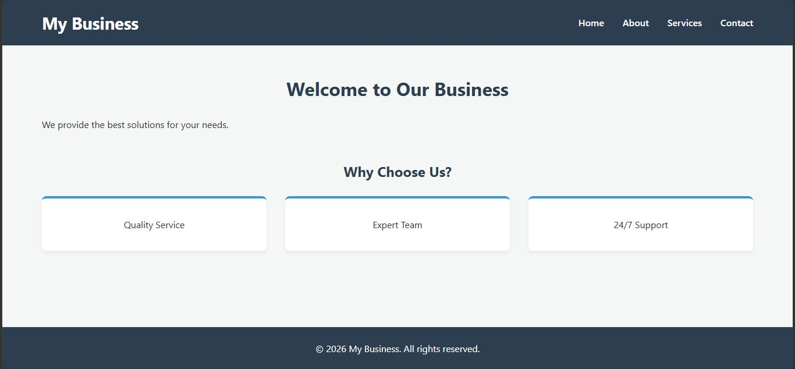
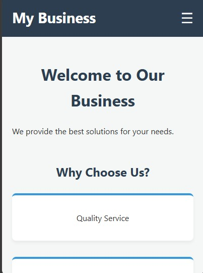
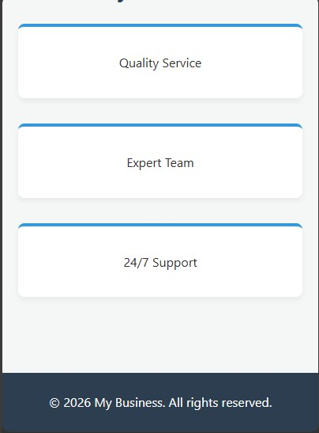

# My Business Website Project

## Project Overview
This is a fully responsive, multi-page frontend website built for a local business. The goal of this project was to demonstrate mastery of semantic HTML5, CSS layouts (Grid and Flexbox), SASS architecture, and vanilla JavaScript interactivity.

## Setup Instructions
1. Download or clone the repository files.
2. Open `index.html` in your preferred web browser.
3. No build tools are required to view the live site, though the Live Sass Compiler was used for CSS development.

## Code Structure
```text
business-website/
├── css/
│   ├── main.css
│   └── main.css.map
├── images/
│   ├── desktop-view.png
│   └── mobile-view.png
├── js/
│   ├── main.js
│   └── form-validation.js
├── scss/
│   ├── _variables.scss
│   └── main.scss
├── index.html
├── about.html
├── services.html
├── contact.html
└── README.md

## Visual Documentation
### Desktop View

### Mobile View


Technical Details & Component Architecture
Layouts: CSS Grid is utilized for the primary feature and service cards to ensure equal spacing and auto-fitting columns. CSS Flexbox is used to align the navigation bar elements.

SASS: Styling is organized using variables (_variables.scss for brand colors and fonts) and compiled into a single main.css file.

Responsiveness: Media queries restructure the navigation into a toggleable hamburger menu on screens smaller than 768px.

Testing Evidence
Cross-Browser: Tested and rendering correctly on modern browsers.

Responsiveness: Verified mobile layout and hamburger menu functionality via Developer Tools device simulation.

Validation: Custom vanilla JavaScript prevents empty form submissions on the contact page and displays a success alert upon completion
